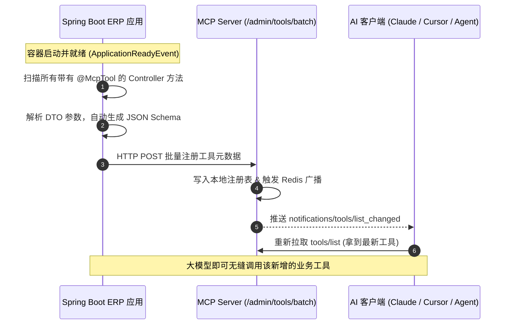

# Spring Boot 接入 MCP Server 实战指南：`@McpTool` 动态注解与自动上报

本文档用于指导在现有的 **Java Spring Boot ERP 工程** 中，通过自定义注解 `@McpTool` 实现业务接口的**“开箱即用、启动自动上报、热插拔注册”**到 MCP Server。

---

## 一、 整体交互流程



---

## 二、 Maven 依赖准备

确保 Spring Boot 工程具备 Web、Jackson 及可选的 OpenAPI/Swagger 依赖（通常企业级 ERP 已具备）：

```xml
<dependencies>
    <!-- Spring Web -->
    <dependency>
        <groupId>org.springframework.boot</groupId>
        <artifactId>spring-boot-starter-web</artifactId>
    </dependency>

    <!-- 参数校验 (JSR-380) -->
    <dependency>
        <groupId>org.springframework.boot</groupId>
        <artifactId>spring-boot-starter-validation</artifactId>
    </dependency>

    <!-- Jackson (JSON 序列化与 Schema 解析) -->
    <dependency>
        <groupId>com.fasterxml.jackson.core</groupId>
        <artifactId>jackson-databind</artifactId>
    </dependency>
</dependencies>
```

---

## 三、 核心代码实现（可直接复制到工程中）

建议在 Spring Boot 项目中新建一个包，如 `com.yourcompany.erp.mcp`，放入以下类：

### 1. 自定义注解 `@McpTool`

```java
package com.yourcompany.erp.mcp.annotation;

import java.lang.annotation.*;

/**
 * 标记该 Controller 接口作为 MCP 工具向大模型开放
 */
@Target(ElementType.METHOD)
@Retention(RetentionPolicy.RUNTIME)
@Documented
public @interface McpTool {

    /**
     * 工具英文唯一标识（大模型调用的函数名）
     * 规则：英文、数字、下划线，例如：query_inventory_stock
     */
    String name();

    /**
     * 工具功能描述（相当于给 LLM 的 Prompt，需说明清楚什么场景下调用）
     */
    String description();

    /**
     * 工具所属业务分类，默认 common
     */
    String category() default "common";

    /**
     * 接口调用超时时间 (毫秒)，默认 5000ms
     */
    int timeoutMs() default 5000;

    /**
     * 裁剪出参字段：只把指定的字段返回给大模型（节约 Token，防止无关字段干扰）
     * 留空则返回整个响应体
     */
    String[] pickFields() default {};
}
```

---

### 2. 工具元数据 DTO 定义（对应 MCP Server 端要求）

```java
package com.yourcompany.erp.mcp.dto;

import java.util.List;
import java.util.Map;

public class ToolMetadataDTO {
    private String toolName;
    private String description;
    private boolean enabled = true;
    private String category;
    private Map<String, Object> inputSchema;
    private InvocationConfig invocation;
    private ResponseFilterConfig responseFilter;
    private String source = "spring-boot-erp";

    public static class InvocationConfig {
        private String url;
        private String method = "POST";
        private int timeoutMs = 5000;
        private Map<String, String> headers;

        public String getUrl() { return url; }
        public void setUrl(String url) { this.url = url; }
        public String getMethod() { return method; }
        public void setMethod(String method) { this.method = method; }
        public int getTimeoutMs() { return timeoutMs; }
        public void setTimeoutMs(int timeoutMs) { this.timeoutMs = timeoutMs; }
        public Map<String, String> getHeaders() { return headers; }
        public void setHeaders(Map<String, String> headers) { this.headers = headers; }
    }

    public static class ResponseFilterConfig {
        private List<String> pickFields;
        private int maxChars = 10000;

        public List<String> getPickFields() { return pickFields; }
        public void setPickFields(List<String> pickFields) { this.pickFields = pickFields; }
        public int getMaxChars() { return maxChars; }
        public void setMaxChars(int maxChars) { this.maxChars = maxChars; }
    }

    // Getter & Setter
    public String getToolName() { return toolName; }
    public void setToolName(String toolName) { this.toolName = toolName; }
    public String getDescription() { return description; }
    public void setDescription(String description) { this.description = description; }
    public boolean isEnabled() { return enabled; }
    public void setEnabled(boolean enabled) { this.enabled = enabled; }
    public String getCategory() { return category; }
    public void setCategory(String category) { this.category = category; }
    public Map<String, Object> getInputSchema() { return inputSchema; }
    public void setInputSchema(Map<String, Object> inputSchema) { this.inputSchema = inputSchema; }
    public InvocationConfig getInvocation() { return invocation; }
    public void setInvocation(InvocationConfig invocation) { this.invocation = invocation; }
    public ResponseFilterConfig getResponseFilter() { return responseFilter; }
    public void setResponseFilter(ResponseFilterConfig responseFilter) { this.responseFilter = responseFilter; }
    public String getSource() { return source; }
    public void setSource(String source) { this.source = source; }
}
```

---

### 3. 轻量级 DTO 转 JSON Schema 工具类

```java
package com.yourcompany.erp.mcp.util;

import java.lang.reflect.Field;
import java.util.*;

/**
 * 将 Java DTO 类属性解析为大模型兼容的 JSON Schema 结构
 */
public class JsonSchemaGenerator {

    public static Map<String, Object> generateSchema(Class<?> clazz) {
        Map<String, Object> schema = new LinkedHashMap<>();
        schema.put("type", "object");

        Map<String, Object> properties = new LinkedHashMap<>();
        List<String> requiredList = new ArrayList<>();

        if (clazz != null && !clazz.equals(Void.class)) {
            Field[] fields = clazz.getDeclaredFields();
            for (Field field : fields) {
                String fieldName = field.getName();
                Map<String, Object> prop = new LinkedHashMap<>();

                Class<?> type = field.getType();
                if (type.equals(String.class)) {
                    prop.put("type", "string");
                } else if (type.equals(Integer.class) || type.equals(int.class) ||
                           type.equals(Long.class) || type.equals(long.class)) {
                    prop.put("type", "integer");
                } else if (type.equals(Double.class) || type.equals(double.class) ||
                           type.equals(Float.class) || type.equals(float.class)) {
                    prop.put("type", "number");
                } else if (type.equals(Boolean.class) || type.equals(boolean.class)) {
                    prop.put("type", "boolean");
                } else if (List.class.isAssignableFrom(type) || type.isArray()) {
                    prop.put("type", "array");
                } else {
                    prop.put("type", "object");
                }

                // 读取说明（如兼容 Swagger 的 @Schema 或自定义描述）
                prop.put("description", "参数: " + fieldName);

                properties.put(fieldName, prop);
            }
        }

        schema.put("properties", properties);
        if (!requiredList.isEmpty()) {
            schema.put("required", requiredList);
        }

        return schema;
    }
}
```

---

### 4. 自动扫描与上报核心组件 (`McpAutoReporter`)

```java
package com.yourcompany.erp.mcp;

import com.yourcompany.erp.mcp.annotation.McpTool;
import com.yourcompany.erp.mcp.dto.ToolMetadataDTO;
import com.yourcompany.erp.mcp.util.JsonSchemaGenerator;
import org.slf4j.Logger;
import org.slf4j.LoggerFactory;
import org.springframework.beans.factory.annotation.Autowired;
import org.springframework.beans.factory.annotation.Value;
import org.springframework.boot.context.event.ApplicationReadyEvent;
import org.springframework.context.ApplicationContext;
import org.springframework.context.ApplicationListener;
import org.springframework.http.*;
import org.springframework.stereotype.Component;
import org.springframework.web.bind.annotation.*;
import org.springframework.web.client.RestTemplate;

import java.lang.reflect.Method;
import java.lang.reflect.Parameter;
import java.util.*;

@Component
public class McpAutoReporter implements ApplicationListener<ApplicationReadyEvent> {

    private static final Logger log = LoggerFactory.getLogger(McpAutoReporter);

    @Value("${mcp.server.url:http://127.0.0.1:3000}")
    private String mcpServerUrl;

    @Value("${mcp.server.api-key:default-mcp-secret-key-change-in-production}")
    private String mcpApiKey;

    @Value("${server.port:8080}")
    private String serverPort;

    @Value("${mcp.erp.callback-host:http://127.0.0.1}")
    private String erpCallbackHost;

    @Autowired
    private ApplicationContext applicationContext;

    private final RestTemplate restTemplate = new RestTemplate();

    @Override
    public void onApplicationEvent(ApplicationReadyEvent event) {
        log.info("[MCP] 开始扫描 Spring Boot 应用中的 @McpTool 接口...");
        List<ToolMetadataDTO> tools = scanMcpTools();

        if (tools.isEmpty()) {
            log.info("[MCP] 未发现任何带有 @McpTool 的接口");
            return;
        }

        log.info("[MCP] 扫描完成，共发现 {} 个 MCP 工具，正在上报到 MCP Server: {}", tools.size(), mcpServerUrl);
        reportToolsToMcpServer(tools);
    }

    private List<ToolMetadataDTO> scanMcpTools() {
        List<ToolMetadataDTO> result = new ArrayList<>();
        Map<String, Object> controllers = applicationContext.getBeansWithAnnotation(RestController.class);

        for (Object bean : controllers.values()) {
            Class<?> targetClass = bean.getClass();
            RequestMapping classMapping = targetClass.getAnnotation(RequestMapping.class);
            String basePath = (classMapping != null && classMapping.value().length > 0) ? classMapping.value()[0] : "";

            for (Method method : targetClass.getDeclaredMethods()) {
                McpTool annotation = method.getAnnotation(McpTool.class);
                if (annotation == null) continue;

                String subPath = "";
                String httpMethod = "POST";

                PostMapping postMapping = method.getAnnotation(PostMapping.class);
                GetMapping getMapping = method.getAnnotation(GetMapping.class);

                if (postMapping != null && postMapping.value().length > 0) {
                    subPath = postMapping.value()[0];
                    httpMethod = "POST";
                } else if (getMapping != null && getMapping.value().length > 0) {
                    subPath = getMapping.value()[0];
                    httpMethod = "GET";
                }

                String fullUrl = erpCallbackHost + ":" + serverPort + basePath + subPath;

                // 解析方法入参中的 RequestBody
                Class<?> requestBodyClass = null;
                for (Parameter param : method.getParameters()) {
                    if (param.isAnnotationPresent(RequestBody.class)) {
                        requestBodyClass = param.getType();
                        break;
                    }
                }

                ToolMetadataDTO meta = new ToolMetadataDTO();
                meta.setToolName(annotation.name());
                meta.setDescription(annotation.description());
                meta.setCategory(annotation.category());
                meta.setInputSchema(JsonSchemaGenerator.generateSchema(requestBodyClass));

                ToolMetadataDTO.InvocationConfig inv = new ToolMetadataDTO.InvocationConfig();
                inv.setUrl(fullUrl);
                inv.setMethod(httpMethod);
                inv.setTimeoutMs(annotation.timeoutMs());
                meta.setInvocation(inv);

                if (annotation.pickFields().length > 0) {
                    ToolMetadataDTO.ResponseFilterConfig filter = new ToolMetadataDTO.ResponseFilterConfig();
                    filter.setPickFields(Arrays.asList(annotation.pickFields()));
                    meta.setResponseFilter(filter);
                }

                result.add(meta);
            }
        }
        return result;
    }

    private void reportToolsToMcpServer(List<ToolMetadataDTO> tools) {
        try {
            HttpHeaders headers = new HttpHeaders();
            headers.setContentType(MediaType.APPLICATION_JSON);
            headers.set("X-API-Key", mcpApiKey);

            Map<String, Object> body = new HashMap<>();
            body.put("tools", tools);

            HttpEntity<Map<String, Object>> request = new HttpEntity<>(body, headers);
            String registerUrl = mcpServerUrl + "/admin/tools/batch";

            ResponseEntity<String> response = restTemplate.postForEntity(registerUrl, request, String.class);
            if (response.getStatusCode().is2xxSuccessful()) {
                log.info("[MCP] 工具批量注册成功! 响应: {}", response.getBody());
            } else {
                log.error("[MCP] 工具注册失败，HTTP 状态码: {}", response.getStatusCode());
            }
        } catch (Exception e) {
            log.error("[MCP] 无法连接到 MCP Server 上报接口，请检查服务是否就绪: {}", e.getMessage());
        }
    }
}
```

---

## 四、 业务 Controller 使用示例（开发标准示范）

在具体的 ERP 业务模块中，新建或编写 Controller：

```java
package com.yourcompany.erp.controller.mcp;

import com.yourcompany.erp.mcp.annotation.McpTool;
import org.springframework.web.bind.annotation.*;

@RestController
@RequestMapping("/api/mcp")
public class ErpMcpToolsController {

    // 1. 查询物料库存工具
    @McpTool(
        name = "query_inventory_stock",
        description = "根据物料编码查询 ERP 系统中的当前可用库存与仓库分布",
        category = "inventory",
        pickFields = {"materialCode", "availableQuantity", "warehouseName"} // 仅返回3个核心字段给大模型
    )
    @PostMapping("/stock/query")
    public InventoryResult queryStock(@RequestBody StockQueryDTO query) {
        // 直接调用原有的 InventoryService 业务逻辑
        return new InventoryResult(query.getMaterialCode(), 1250, "华东一号总仓");
    }

    // 2. 审批销售订单工具
    @McpTool(
        name = "approve_sales_order",
        description = "对指定的 ERP 销售订单执行审批通过或驳回操作",
        category = "sales"
    )
    @PostMapping("/order/approve")
    public ApprovalResult approveOrder(@RequestBody OrderApprovalDTO dto) {
        // 调用底层的订单审批流
        return new ApprovalResult(dto.getOrderNo(), "SUCCESS", "审批已通过");
    }

    // 专门为大模型定制的精简入参 DTO（杜绝百字段万能 Request）
    public static class StockQueryDTO {
        private String materialCode;
        public String getMaterialCode() { return materialCode; }
        public void setMaterialCode(String materialCode) { this.materialCode = materialCode; }
    }

    public static class OrderApprovalDTO {
        private String orderNo;
        private String reason;
        public String getOrderNo() { return orderNo; }
        public void setOrderNo(String orderNo) { this.orderNo = orderNo; }
        public String getReason() { return reason; }
        public void setReason(String reason) { this.reason = reason; }
    }

    public static class InventoryResult {
        private String materialCode;
        private int availableQuantity;
        private String warehouseName;
        public InventoryResult(String code, int qty, String wh) {
            this.materialCode = code;
            this.availableQuantity = qty;
            this.warehouseName = wh;
        }
        public String getMaterialCode() { return materialCode; }
        public int getAvailableQuantity() { return availableQuantity; }
        public String getWarehouseName() { return warehouseName; }
    }

    public static class ApprovalResult {
        private String orderNo;
        private String status;
        private String message;
        public ApprovalResult(String no, String s, String m) {
            this.orderNo = no;
            this.status = s;
            this.message = m;
        }
        public String getOrderNo() { return orderNo; }
        public String getStatus() { return status; }
        public String getMessage() { return message; }
    }
}
```

---

## 五、 `application.yml` 配置说明

在 Spring Boot 的 `application.yml` 中添加 MCP 上报目标地址和安全密钥：

```yaml
mcp:
  server:
    # 部署在服务器上的 MCP Server 地址（如果与 ERP 在同一内网，填内网 IP）
    url: http://192.168.1.50:3000
    # 必须与 MCP Server 的 MCP_API_KEY 保持一致
    api-key: mcp-secret-key-prod-2026
  erp:
    # MCP Server 回调调用 Java ERP 接口时的域名/内网IP
    callback-host: http://192.168.1.20
```

---

## 六、 运行与验证效果

1. 启动 **MCP Server**；
2. 启动 **Spring Boot ERP** 工程；
3. 查看 Spring Boot 控制台输出：
   ```text
   [MCP] 开始扫描 Spring Boot 应用中的 @McpTool 接口...
   [MCP] 扫描完成，共发现 2 个 MCP 工具，正在上报到 MCP Server: http://192.168.1.50:3000
   [MCP] 工具批量注册成功! 响应: {"success":true,"message":"成功批量注册 2 个工具，已触发广播"}
   ```
4. 此时连接到 MCP Server 的 AI 客户端（如 Claude、Cursor 等）会立即收到 `notifications/tools/list_changed`，无需重启客户端，新的两个 ERP 工具就立刻可用了！
