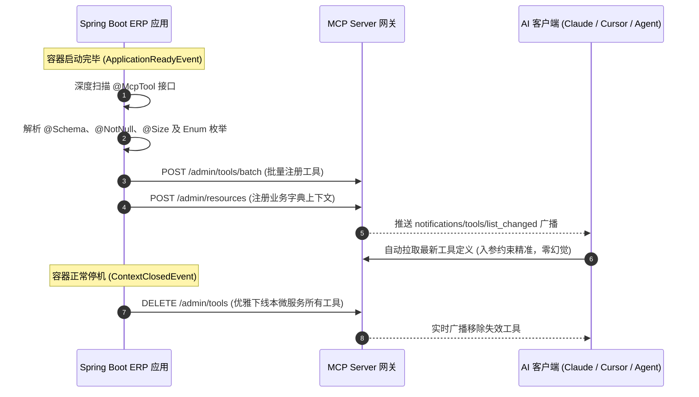

# Spring Boot 接入 MCP Server 企业级实战指南 (高阶生产版)

本文档指导在现有的 **Java Spring Boot ERP 工程** 中，通过自定义注解 `@McpTool` 与深度自省组件，实现业务接口的**“开箱即用、JSR-303 与 Swagger 规则深度提取、启动自动注册、关机优雅注销”**。

---

## 一、 整体交互架构



---

## 二、 Maven 依赖推荐

在已有 Spring Boot 工程中，确保包含以下常见组件（若已有无需重复引入）：

```xml
<dependencies>
    <!-- Spring Web -->
    <dependency>
        <groupId>org.springframework.boot</groupId>
        <artifactId>spring-boot-starter-web</artifactId>
    </dependency>

    <!-- JSR-380 参数校验 (用于提取 @NotNull, @Size, @Min 等规则) -->
    <dependency>
        <groupId>org.springframework.boot</groupId>
        <artifactId>spring-boot-starter-validation</artifactId>
    </dependency>

    <!-- 可选: Swagger / SpringDoc (用于自动提取 @Schema 中文字段说明和示例) -->
    <dependency>
        <groupId>io.swagger.core.v3</groupId>
        <artifactId>swagger-annotations</artifactId>
        <version>2.2.20</version>
        <optional>true</optional>
    </dependency>
</dependencies>
```

---

## 三、 核心实现类源码清单（直接拷贝可用）

在项目中新建包名 `com.yourcompany.erp.mcp`：

### 1. 自定义注解 `@McpTool`

```java
package com.yourcompany.erp.mcp.annotation;

import java.lang.annotation.*;

/**
 * 声明该 Controller 方法作为 MCP 工具向大模型开放
 */
@Target(ElementType.METHOD)
@Retention(RetentionPolicy.RUNTIME)
@Documented
public @interface McpTool {

    /**
     * 工具英文唯一标识（大模型调用的函数名）
     * 规则：英文下划线命名，如 query_erp_inventory
     */
    String name();

    /**
     * 工具功能说明（Prompt），详细描述该工具能做什么、何时调用
     */
    String description();

    /**
     * 所属业务分类，如 inventory, sales, finance
     */
    String category() default "common";

    /**
     * 接口调用超时时间 (毫秒)，默认 5000ms
     */
    int timeoutMs() default 5000;

    /**
     * 出参裁剪字段：只把指定的关键字段返回给大模型（节约 Token，防信息污染）
     * 为空时返回整个响应体
     */
    String[] pickFields() default {};
}
```

---

### 2. 高级 Schema 生成器（支持 JSR-303、Swagger、Enum 枚举）

```java
package com.yourcompany.erp.mcp.util;

import javax.validation.constraints.*;
import java.lang.reflect.Field;
import java.lang.reflect.ParameterizedType;
import java.lang.reflect.Type;
import java.util.*;

/**
 * 深度解析 Java DTO 类，生成带约束与中文提示的高质量 JSON Schema
 */
public class AdvancedJsonSchemaGenerator {

    public static Map<String, Object> generateSchema(Class<?> clazz) {
        Map<String, Object> schema = new LinkedHashMap<>();
        schema.put("type", "object");

        Map<String, Object> properties = new LinkedHashMap<>();
        List<String> requiredList = new ArrayList<>();

        if (clazz == null || clazz.equals(Void.class) || clazz.equals(void.class)) {
            schema.put("properties", properties);
            return schema;
        }

        // 递归获取本类及父类所有字段
        List<Field> allFields = new ArrayList<>();
        Class<?> current = clazz;
        while (current != null && current != Object.class) {
            allFields.addAll(Arrays.asList(current.getDeclaredFields()));
            current = current.getSuperclass();
        }

        for (Field field : allFields) {
            // 忽略序列化版本号
            if ("serialVersionUID".equals(field.getName())) continue;

            String fieldName = field.getName();
            Map<String, Object> prop = parseFieldProperty(field);

            // 1. 解析 JSR-303 必填注解
            if (field.isAnnotationPresent(NotNull.class) ||
                field.isAnnotationPresent(NotBlank.class) ||
                field.isAnnotationPresent(NotEmpty.class)) {
                requiredList.add(fieldName);
            }

            // 2. 解析长度与范围约束
            Size size = field.getAnnotation(Size.class);
            if (size != null) {
                if (size.min() > 0) prop.put("minLength", size.min());
                if (size.max() < Integer.MAX_VALUE) prop.put("maxLength", size.max());
            }

            Min min = field.getAnnotation(Min.class);
            if (min != null) prop.put("minimum", min.value());

            Max max = field.getAnnotation(Max.class);
            if (max != null) prop.put("maximum", max.value());

            Pattern pattern = field.getAnnotation(Pattern.class);
            if (pattern != null) prop.put("pattern", pattern.regexp());

            properties.put(fieldName, prop);
        }

        schema.put("properties", properties);
        if (!requiredList.isEmpty()) {
            schema.put("required", requiredList);
        }

        return schema;
    }

    private static Map<String, Object> parseFieldProperty(Field field) {
        Map<String, Object> prop = new LinkedHashMap<>();
        Class<?> type = field.getType();

        // 提取说明（反射读取 Swagger @Schema 注解，避免直接硬编码强依赖）
        String desc = extractDescriptionFromAnnotations(field);
        prop.put("description", desc != null ? desc : "参数: " + field.getName());

        // 枚举类型特殊处理
        if (type.isEnum()) {
            prop.put("type", "string");
            Object[] enumConstants = type.getEnumConstants();
            List<String> enumNames = new ArrayList<>();
            for (Object ec : enumConstants) {
                enumNames.add(ec.toString());
            }
            prop.put("enum", enumNames);
            prop.put("description", prop.get("description") + " (可选枚举值: " + String.join(", ", enumNames) + ")");
            return prop;
        }

        if (type.equals(String.class)) {
            prop.put("type", "string");
        } else if (type.equals(Integer.class) || type.equals(int.class) ||
                   type.equals(Long.class) || type.equals(long.class) ||
                   type.equals(Short.class) || type.equals(short.class)) {
            prop.put("type", "integer");
        } else if (type.equals(Double.class) || type.equals(double.class) ||
                   type.equals(Float.class) || type.equals(float.class) ||
                   type.equals(java.math.BigDecimal.class)) {
            prop.put("type", "number");
        } else if (type.equals(Boolean.class) || type.equals(boolean.class)) {
            prop.put("type", "boolean");
        } else if (List.class.isAssignableFrom(type) || Set.class.isAssignableFrom(type)) {
            prop.put("type", "array");
            // 提取泛型类型
            Type genericType = field.getGenericType();
            if (genericType instanceof ParameterizedType) {
                Type actual = ((ParameterizedType) genericType).getActualTypeArguments()[0];
                if (actual instanceof Class) {
                    Class<?> itemClass = (Class<?>) actual;
                    if (itemClass.equals(String.class)) {
                        prop.put("items", Collections.singletonMap("type", "string"));
                    } else if (itemClass.isEnum()) {
                        Map<String, Object> itemSchema = new LinkedHashMap<>();
                        itemSchema.put("type", "string");
                        List<String> enums = new ArrayList<>();
                        for (Object o : itemClass.getEnumConstants()) enums.add(o.toString());
                        itemSchema.put("enum", enums);
                        prop.put("items", itemSchema);
                    } else {
                        prop.put("items", generateSchema(itemClass));
                    }
                }
            }
        } else {
            // 普通复杂嵌套对象
            prop.put("type", "object");
        }

        return prop;
    }

    private static String extractDescriptionFromAnnotations(Field field) {
        try {
            // 尝试通过反射读取 io.swagger.v3.oas.annotations.media.Schema
            for (java.lang.annotation.Annotation anno : field.getAnnotations()) {
                String annoName = anno.annotationType().getSimpleName();
                if ("Schema".equals(annoName) || "ApiModelProperty".equals(annoName)) {
                    java.lang.reflect.Method descMethod = anno.annotationType().getMethod("description");
                    String val = (String) descMethod.invoke(anno);
                    if (val != null && !val.trim().isEmpty()) {
                        return val;
                    }
                }
            }
        } catch (Exception ignored) {}
        return null;
    }
}
```

---

### 3. 全生命周期自动注册与注销器 (`McpLifecycleManager`)

该类在应用**启动就绪时自动上报注册**，在**应用关机时自动注销下线**：

```java
package com.yourcompany.erp.mcp;

import com.yourcompany.erp.mcp.annotation.McpTool;
import com.yourcompany.erp.mcp.util.AdvancedJsonSchemaGenerator;
import org.slf4j.Logger;
import org.slf4j.LoggerFactory;
import org.springframework.beans.factory.annotation.Autowired;
import org.springframework.beans.factory.annotation.Value;
import org.springframework.boot.context.event.ApplicationReadyEvent;
import org.springframework.context.ApplicationContext;
import org.springframework.context.event.ContextClosedEvent;
import org.springframework.context.event.EventListener;
import org.springframework.http.*;
import org.springframework.stereotype.Component;
import org.springframework.web.bind.annotation.*;
import org.springframework.web.client.RestTemplate;

import java.lang.reflect.Method;
import java.lang.reflect.Parameter;
import java.util.*;

@Component
public class McpLifecycleManager {

    private static final Logger log = LoggerFactory.getLogger(McpLifecycleManager.class);

    @Value("${mcp.server.url:http://127.0.0.1:3000}")
    private String mcpServerUrl;

    @Value("${mcp.server.api-key:default-mcp-secret-key-change-in-production}")
    private String mcpApiKey;

    @Value("${server.port:8080}")
    private String serverPort;

    @Value("${mcp.erp.callback-host:http://127.0.0.1}")
    private String erpCallbackHost;

    @Autowired
    private ApplicationContext applicationContext;

    private final RestTemplate restTemplate = new RestTemplate();
    private final List<String> registeredToolNames = new ArrayList<>();

    /**
     * 1. 启动事件监听：扫描所有 @McpTool 并批量注册
     */
    @EventListener(ApplicationReadyEvent.class)
    public void onApplicationReady() {
        log.info("[MCP] Spring Boot 启动就绪，开始扫描带有 @McpTool 的接口...");
        List<Map<String, Object>> tools = scanMcpTools();

        if (tools.isEmpty()) {
            log.info("[MCP] 未发现任何 @McpTool 接口");
            return;
        }

        log.info("[MCP] 发现 {} 个工具，正在批量同步至 MCP Gateway: {}", tools.size(), mcpServerUrl);
        reportBatchTools(tools);
    }

    /**
     * 2. 停机事件监听：服务关机时优雅注销下线
     */
    @EventListener(ContextClosedEvent.class)
    public void onContextClosed() {
        if (registeredToolNames.isEmpty()) return;

        log.info("[MCP] 捕获到停机信号，正在优雅下线本节点注册的 {} 个 MCP 工具...", registeredToolNames.size());
        for (String toolName : registeredToolNames) {
            try {
                HttpHeaders headers = new HttpHeaders();
                headers.set("X-API-Key", mcpApiKey);
                HttpEntity<Void> request = new HttpEntity<>(headers);
                restTemplate.exchange(mcpServerUrl + "/admin/tools/" + toolName, HttpMethod.DELETE, request, String.class);
            } catch (Exception e) {
                log.warn("[MCP] 注销工具 '{}' 失败: {}", toolName, e.getMessage());
            }
        }
        log.info("[MCP] 所有 MCP 工具已成功注销下线 👋");
    }

    private List<Map<String, Object>> scanMcpTools() {
        List<Map<String, Object>> list = new ArrayList<>();
        Map<String, Object> controllers = applicationContext.getBeansWithAnnotation(RestController.class);

        for (Object bean : controllers.values()) {
            Class<?> targetClass = bean.getClass();
            RequestMapping classMapping = targetClass.getAnnotation(RequestMapping.class);
            String basePath = (classMapping != null && classMapping.value().length > 0) ? classMapping.value()[0] : "";

            for (Method method : targetClass.getDeclaredMethods()) {
                McpTool annotation = method.getAnnotation(McpTool.class);
                if (annotation == null) continue;

                String subPath = "";
                String httpMethod = "POST";

                PostMapping postMapping = method.getAnnotation(PostMapping.class);
                GetMapping getMapping = method.getAnnotation(GetMapping.class);

                if (postMapping != null && postMapping.value().length > 0) {
                    subPath = postMapping.value()[0];
                    httpMethod = "POST";
                } else if (getMapping != null && getMapping.value().length > 0) {
                    subPath = getMapping.value()[0];
                    httpMethod = "GET";
                }

                String fullUrl = erpCallbackHost + ":" + serverPort + basePath + subPath;

                // 提取入参中的 RequestBody
                Class<?> bodyClass = null;
                for (Parameter param : method.getParameters()) {
                    if (param.isAnnotationPresent(RequestBody.class)) {
                        bodyClass = param.getType();
                        break;
                    }
                }

                Map<String, Object> meta = new LinkedHashMap<>();
                meta.put("toolName", annotation.name());
                meta.put("description", annotation.description());
                meta.put("category", annotation.category());
                meta.put("enabled", true);
                meta.put("inputSchema", AdvancedJsonSchemaGenerator.generateSchema(bodyClass));

                Map<String, Object> inv = new LinkedHashMap<>();
                inv.put("url", fullUrl);
                inv.put("method", httpMethod);
                inv.put("timeoutMs", annotation.timeoutMs());
                meta.put("invocation", inv);

                if (annotation.pickFields().length > 0) {
                    Map<String, Object> filter = new LinkedHashMap<>();
                    filter.put("pickFields", Arrays.asList(annotation.pickFields()));
                    meta.put("responseFilter", filter);
                }

                list.add(meta);
                registeredToolNames.add(annotation.name());
            }
        }
        return list;
    }

    private void reportBatchTools(List<Map<String, Object>> tools) {
        try {
            HttpHeaders headers = new HttpHeaders();
            headers.setContentType(MediaType.APPLICATION_JSON);
            headers.set("X-API-Key", mcpApiKey);

            Map<String, Object> body = new HashMap<>();
            body.put("tools", tools);

            HttpEntity<Map<String, Object>> request = new HttpEntity<>(body, headers);
            ResponseEntity<String> response = restTemplate.postForEntity(
                mcpServerUrl + "/admin/tools/batch", request, String.class
            );

            log.info("[MCP] 工具批量注册成功! 响应: {}", response.getBody());
        } catch (Exception e) {
            log.error("[MCP] 无法连接到 MCP Gateway，请检查网关是否已启动: {}", e.getMessage());
        }
    }
}
```

---

## 四、 规范实战示例（Controller 与 DTO）

使用标准注解，模型将获得极致精准的提示与边界约束：

```java
package com.yourcompany.erp.controller.mcp;

import com.yourcompany.erp.mcp.annotation.McpTool;
import io.swagger.v3.oas.annotations.media.Schema;
import javax.validation.constraints.*;
import org.springframework.web.bind.annotation.*;

@RestController
@RequestMapping("/api/mcp/order")
public class OrderMcpController {

    @McpTool(
        name = "query_sales_orders",
        description = "根据时间范围与订单状态分页查询销售订单列表",
        category = "sales",
        pickFields = {"total", "records"} // 裁剪冗余字段
    )
    @PostMapping("/query")
    public QueryResult queryOrders(@RequestBody OrderQueryDTO query) {
        // 直接调用底层业务 Service
        return new QueryResult();
    }

    // ==========================================
    // 高质量 DTO 设计范例
    // ==========================================
    public static class OrderQueryDTO {

        @Schema(description = "物料或订单编号，例如: SO202409001", example = "SO202409001")
        @Size(max = 32)
        private String orderNo;

        @Schema(description = "订单业务状态")
        @NotNull(message = "订单状态不可为空")
        private OrderStatusEnum status;

        @Schema(description = "分页大小，1~50之间", example = "20")
        @Min(1)
        @Max(50)
        private Integer pageSize = 20;

        // Getter & Setter
        public String getOrderNo() { return orderNo; }
        public void setOrderNo(String orderNo) { this.orderNo = orderNo; }
        public OrderStatusEnum getStatus() { return status; }
        public void setStatus(OrderStatusEnum status) { this.status = status; }
        public Integer getPageSize() { return pageSize; }
        public void setPageSize(Integer pageSize) { this.pageSize = pageSize; }
    }

    public enum OrderStatusEnum {
        PENDING_PAYMENT,
        PROCESSING,
        SHIPPED,
        COMPLETED,
        CANCELLED
    }

    public static class QueryResult {
        private int total = 1;
        private String[] records = new String[]{"SO202409001 (已发货)"};
        public int getTotal() { return total; }
        public String[] getRecords() { return records; }
    }
}
```

---

## 五、 生成的 Schema 效果对比

经过增强后，大模型端获取到的 JSON Schema 会包含完整的约束：
```json
{
  "type": "object",
  "properties": {
    "orderNo": {
      "type": "string",
      "description": "物料或订单编号，例如: SO202409001",
      "maxLength": 32
    },
    "status": {
      "type": "string",
      "enum": ["PENDING_PAYMENT", "PROCESSING", "SHIPPED", "COMPLETED", "CANCELLED"],
      "description": "订单业务状态 (可选枚举值: PENDING_PAYMENT, PROCESSING, SHIPPED, COMPLETED, CANCELLED)"
    },
    "pageSize": {
      "type": "integer",
      "description": "分页大小，1~50之间",
      "minimum": 1,
      "maximum": 50
    }
  },
  "required": ["status"]
}
```
大模型一目了然知道：
* `status` 是必须传的；
* `status` 只能从 5 个枚举里选一个；
* `pageSize` 最大只能是 50。
**完全彻底杜绝了模型瞎编乱填导致的接口报错！**
